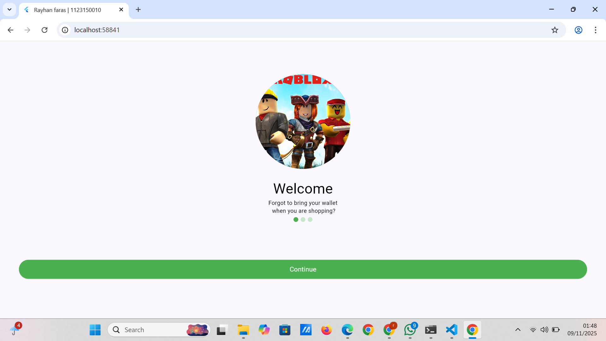
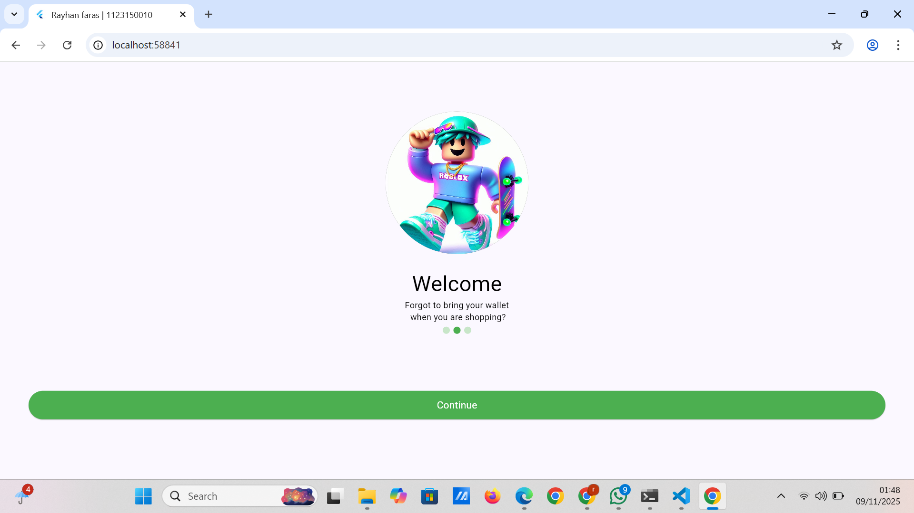
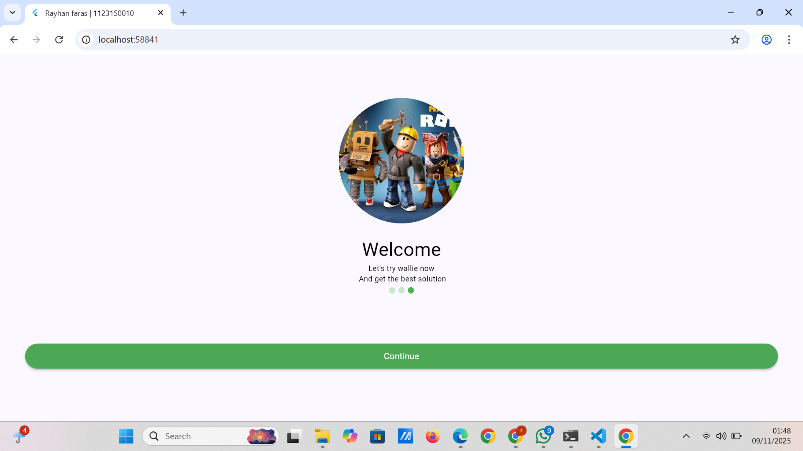
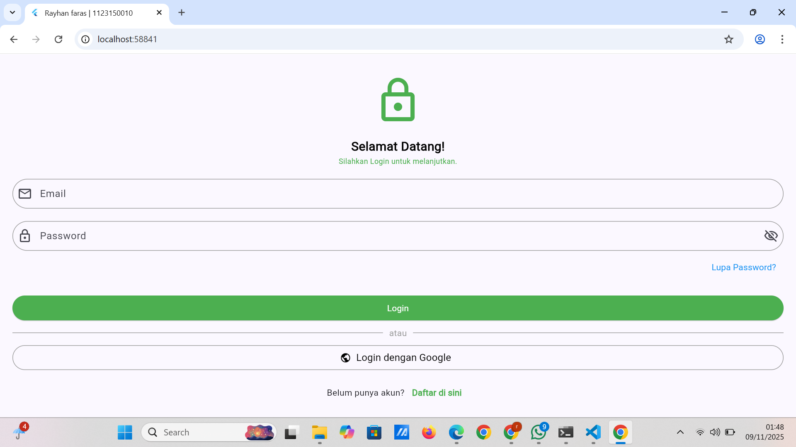

# 📱 Splash Screen Flutter

* **Nama:** Rayhan Faras Ramadhani
* **NIM:** 1123150010

---

## 🖼️ Hasil Screenshot

Tampilan halaman splash screen aplikasi:







---

## ⚙️ Cara Menjalankan Project

1. Buka project di **Android Studio** atau **VS Code**.
2. Pastikan perangkat (emulator atau HP) sudah terhubung.
3. Jalankan perintah berikut di terminal:

   ```bash
   flutter run
   ```
4. Aplikasi akan berjalan langsung di perangkat.

---


---

✨ Matur Suwun ✨